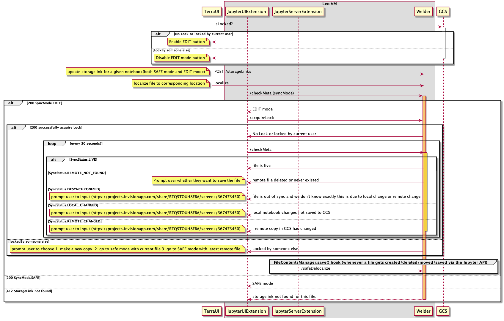

# Welder

Welder is a lightweight webservice intended to be run on Dataproc Clusters and GCE VMs spun up by [Leonardo](https://github.com/DataBiosphere/leonardo). Compute spun up by Leonardo allows users to run interactive tools, such as Jupyter, in the cloud. Welder's primary purpose is to facilitate the persistence of files generated by these tools to a bucket in Google Cloud Storage. See the API section below for a list of endpoints and functions available in Welder.

# Try it out

* export OWNER_EMAIL="fake@gmail.com"
* Run `gcloud auth application-default login`
* Start welder-api-server `sbt server/run`
** you may want to create `server/src/main/resources/application.conf` with the following content
```bash
path-to-storage-links-json = "storage_links.json"
path-to-gcs-metadata-json = "gcs_metadata.json"
working-directory = "/tmp"
```

# Publish container image to Google container registry
* Set up auth for publishing docker image to GCR
`gcloud auth configure-docker`
* Publish welder
`sbt server/docker:publish` (or `sbt server/docker:publishLocal` for local development)

# Development

## Using git secrets
Make sure git secrets is installed:
```bash
brew install git-secrets
```
Ensure git-secrets is run:
<i>If you use the rsync script to run locally you can skip this step</i>
```bash
cp -r hooks/ .git/hooks/
chmod 755 .git/hooks/apply-git-secrets.sh
```

# UI workflow


# How to modify the workflow image?
* Enable [IntelliJ plugin](https://plugins.jetbrains.com/plugin/7017-plantuml-integration)
* modify [UI_Interaction.puml](server/src/main/resources/UI_Interaction.puml)
* Save rendered image as `UI_Interaction.png`
